# geometry-of-relativity

Mechanistic interpretability study of **how LLMs represent contextual relativity** — whether "tall" means tall-for-this-group or tall-in-absolute-terms — via activation geometry, causal steering, and SAE decomposition in Gemma.

**Target venue:** ICML 2026 MI Workshop (May 8 AOE), co-submission to NeurIPS 2026 main track.

## TL;DR

When Gemma sees "Person 16: 170 cm. This person is ___", its adjective choice is
mostly organized by the target's standing within the local context, not by the
raw number alone.

Main findings:
- **Activation geometry is z-structured.** In dense cell-mean PCA, z is often the dominant principal direction; the v10 height grid also shows behavior varies mostly with z rather than raw x.
- **z is available early and used later.** z-score encodings are available early across adjective domains (roughly L1-L7 depending on analysis/model), while causal steering works best later after the representation has been carried and rotated.
- **The z direction partly generalizes across domains.** A shared direction steers most adjective pairs, and multi-seed cross-pair transfer is 56/56 off-diagonal cells significant under BH-FDR. Speed and experience remain pair-specific.
- **SAE features support the same story.** Top z-features have high R^2(z) but near-zero R^2(x) and R^2(token-magnitude), with more cross-pair feature overlap in 9B than 2B; lexical/domain-feature interpretations remain a follow-up.

## Core experimental design

For each prompt, we separate the raw value, the context, and the target's
relative standing:

- $x$: the raw target value, e.g. 170 cm.
- $\mu$: the context mean, e.g. the group average height.
- $\sigma$: the context spread.
- $z$: the context-normalized value:

```math
z = \frac{x - \mu}{\sigma}
```

A model using only $x$ says "170 cm is tall" regardless of the group. A model
using $z$ says "170 cm is tall in a short group, average in an average group,
and short in a very tall group."

The dense v11 design samples a **20 x-values x 20 z-values x 10 context-seeds**
grid. We choose $x$ and $z$ independently, then derive $\mu = x - z\sigma$.
This is the main hygiene fix: it prevents "raw value" and "relative standing"
from being accidentally confounded.

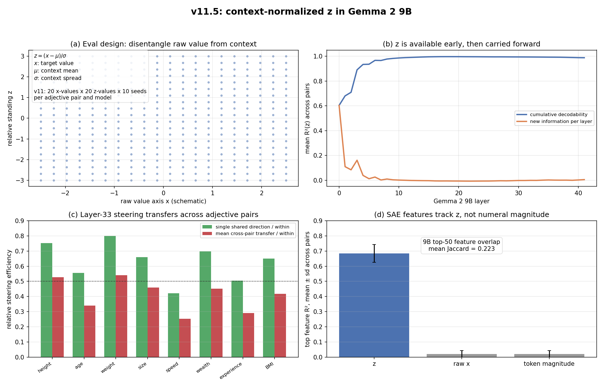

Panel (c) uses Gemma 2 9B layer 33 with alpha=4 steering. For a direction d,
the steering slope is:

```math
\frac{\mathbb{E}[\mathrm{LD}(h+\alpha \hat d)-\mathrm{LD}(h-\alpha \hat d)]}{2\alpha}
```

where LD is the high-minus-low adjective logit difference. The plotted value is
this slope divided by the target pair's own within-pair `primal_z` slope, so it
is a **relative efficiency** rather than a raw logit unit. Green bars use the
single shared z direction; red bars average the seven off-diagonal source-pair
directions transferred into that target pair. Panel (d) is a representational
control: the top SAE feature for each pair is selected by R²(z), then tested
against raw x and numeric-token magnitude. High z with near-zero controls means
the feature is not just a numeral-size tracker.

Technical definitions for LD, R², PCA scores, SAE feature scores, steering
slopes, shared directions, and Jaccard overlap are collected in
[APPENDIX.md](APPENDIX.md).

## Models

| Model | HuggingFace ID | Role |
|---|---|---|
| Gemma 2 2B | `google/gemma-2-2b` | Primary + SAE analysis via Gemma Scope |
| Gemma 2 9B | `google/gemma-2-9b` | Scaling comparison (42 layers, d=3584) |
| Gemma 4 E4B | `google/gemma-4-E4B` | Original extraction (42 layers, d=2560) |
| Gemma 4 31B | `google/gemma-4-31B` | Scaling comparison (60 layers, d=5376) |

## Setup

8 adjective pairs, each tested on a balanced (x, z) grid where x (raw value) and z (context-relative z-score) are independent by construction. v11 uses a dense 20x20 grid (4,000 prompts per pair per model) on all 8 pairs x 2 models (Gemma 2 2B + 9B), totalling ~64k prompts.

| Pair | Adjectives | v11 cell-mean corr(LD, z) |
|---|---|---:|
| height | short / tall | ~0.97 |
| age | young / old | 0.93-0.97 |
| weight | light / heavy | 0.94-0.97 |
| size | small / big | 0.92-0.97 |
| speed | slow / fast | 0.93-0.94 |
| wealth | poor / rich | 0.95-0.97 |
| experience | novice / expert | 0.95-0.97 |
| bmi_abs | thin / obese | ~0.95 |

Here `LD = logit(high adjective) - logit(low adjective)`. The dense v11 result
is the clean behavioral anchor: after averaging over context seeds inside each
(x, z) cell, LD is strongly correlated with z for every pair on both Gemma 2 2B
and 9B. Earlier v9 regressions gave the same qualitative result with a
relativity ratio near 1, but v11 is the cleaner dense-grid confirmation.

The v10 dense-height heatmap is the simplest behavioral picture: once x and z
are independently sampled, the model's high-minus-low adjective logit is mostly
a function of z, not raw x.

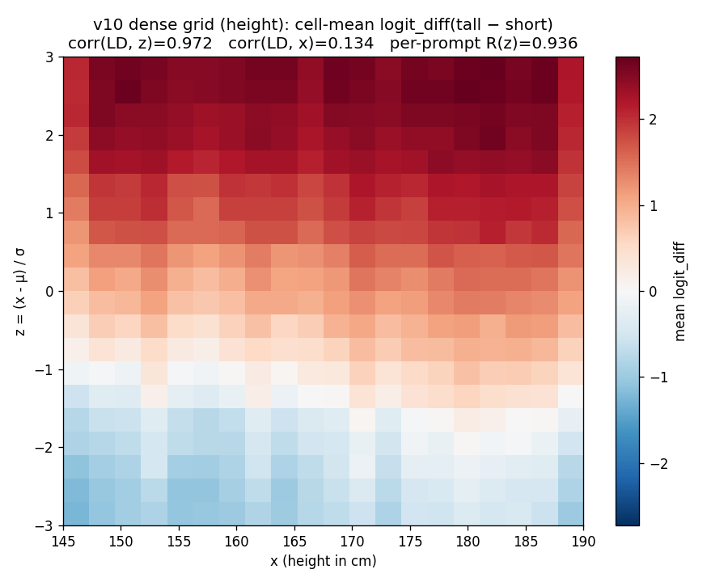

## Controls

The project includes several controls against the cheap interpretation "the
model is just reading the number."

- **Zero-shot raw-x control.** With no context list, zero-shot probes decode raw
  x very well (`cv_R² >= 0.96`), but the zero-shot raw-x probe direction is nearly
  orthogonal to the implicit-context z-direction on the clean grid (`|cos| <=
  0.05`). This supports the claim that the model constructs a new
  context-dependent direction when context is present. Caveat: this is a
  supervised probe result; zero-shot PC1 itself does not reliably track x, and a
  dense v11 follow-up should compare zero-shot x, in-context x, and in-context z
  directions with bootstrap/null bands before treating this as a headline plot.
- **Zero-shot bias check.** Base Gemma has strong token/logit priors even with
  no context; for example some pairs prefer the high adjective at the lowest raw
  value. This is why the dense context grid and cell-mean analyses are needed.
- **Explicit-context prompt control.** Earlier v4 data replaced sampled context
  lists with explicit statements of group mean/spread. This still produced
  z-sensitive behavior: explicit-context R²(logit_diff ~ z) has median about
  0.75 across 8 pairs. Caveat: this condition was smaller than the dense v11
  grid, so it is a sanity check rather than a headline.

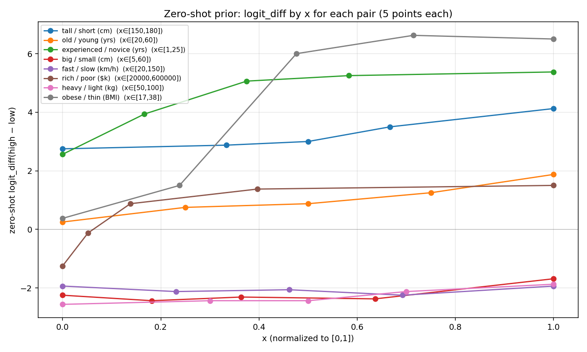
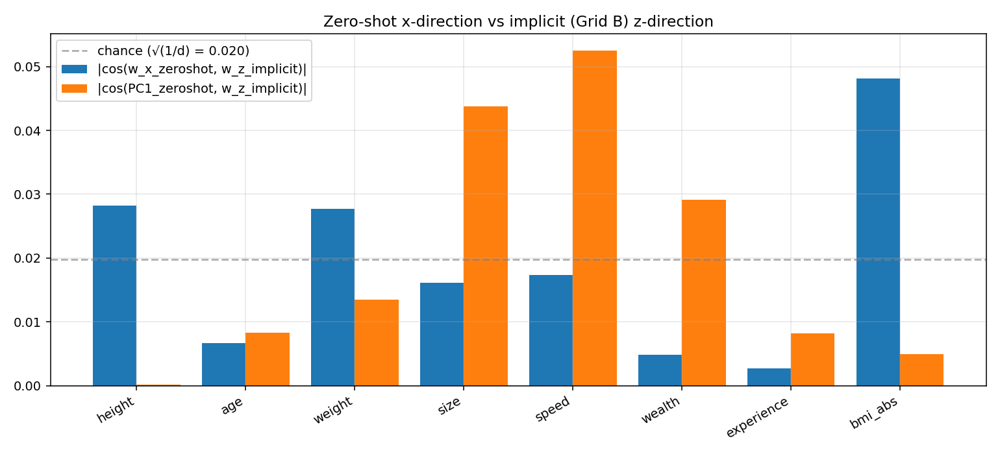

## Key findings

### 1. Activation geometry is organized by z

The first-order result is geometric: once the prompt grid disentangles raw x
from relative standing z, the dominant behavioral and activation axes mostly
track z. On the v10 dense height grid, the model's high-minus-low adjective
logit follows z much more than raw x. On the v11 dense grid, the late-layer
cell-mean PCA for Gemma 2 9B shows ordered z arcs or horseshoes across the 8
adjective pairs.

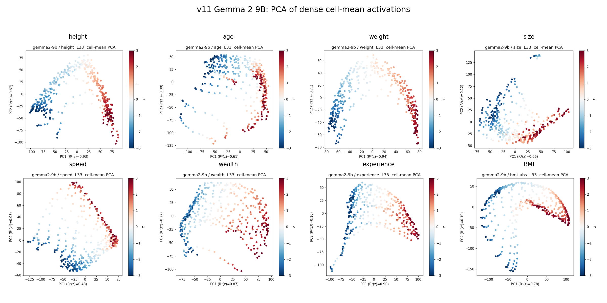

This does not mean every pair is a perfectly linear PC1 story. Some pairs use
curved manifolds, and speed/size/age are weaker in 2B. The central claim is that
the model builds a context-relative scalar geometry; PCA is the most readable
view of it, not the full mechanism.

### 2. z is available early, then carried forward and used later

Layer-wise probes show that z-score encodings are available early across
adjective domains and remain available through the stack. The exact layer
depends on the analysis and model: v11.5 fold-aware increments concentrate most
new linear z information around **L1** (2B) / **L1-L3** (9B), while the older v9
2B sweep showed usable decodability by roughly **L7**.

The causal story is later. On the v10 dense grid, primal_z steering is zero at
layers 5-10, emerges at layer 13, peaks at **layer 14**, and the probe/primal
gap widens to ~8x in late layers. **The dimensions that encode z early are not
necessarily the dimensions downstream layers read from.**

The full 26-layer sweep reveals a three-phase computation:

| Phase | Layers | What happens |
|---|---|---|
| **Encode** | L0-L1 | z computed from tokens in one shot (orth increment R^2 peaks at L1). |
| **Carry + Rotate** | L2-L14 | z is carried forward with minimal new info. Direction actively rotates (cos 0.3-0.5 between adjacent layers). Causal potency emerges at L13, peaks at L14. |
| **Broadcast** | L15-L25 | Direction locks (cos > 0.9). Primal_z amplified 400x from L0. Probe/primal gap widens to ~8x. |

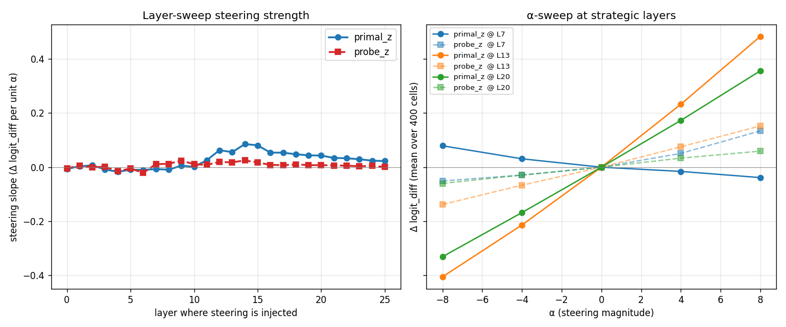

The older v9 2x3 layer sweep remains a useful compact visual for the
encode-vs-use separation: z becomes decodable early, but causal steering
strength appears later.


### 3. Domain-agnostic shared z-direction

A single direction `w_shared` (Procrustes-aligned mean of the 8 per-pair primal_z directions) steers **6/8** pairs at >=50% within-pair efficiency on 2B and **7/8** on 9B (FINDINGS section 16.1). Pairwise mean cosine of per-pair primal_z directions is +0.56 (2B) and +0.52 (9B).

| pair       | 2B shared/within | 9B shared/within |
|---         |---:              |---:              |
| height     | **0.93**         | **0.75**         |
| weight     | **0.89**         | **0.80**         |
| size       | **0.87**         | **0.66**         |
| bmi_abs    | **0.77**         | **0.65**         |
| wealth     | **0.73**         | **0.70**         |
| age        | **0.60**         | **0.56**         |
| speed      | 0.44             | 0.42             |
| experience | 0.27             | 0.50             |

Multi-seed cross-pair transfer with BH-FDR correction at q=0.05 shows **all 56/56 off-diagonal cells significant** on both models (FINDINGS section 16.2). This is not single-seed noise.

*Speed* and *experience* are the two genuinely pair-specific exceptions. Notably, bmi_abs (the absolute-adjective control) aligns with the relative pairs at 0.65-0.77 ratio, ruling out the "shared numeral-magnitude direction" alternative.

Caveat: the multi-seed transfer result is statistically strong, but the
gold-standard pure-x transfer control (holding μ fixed while varying x) is still
queued. So the shared-numeral-magnitude alternative is weakened, not fully
eliminated, for the cross-pair steering matrix.

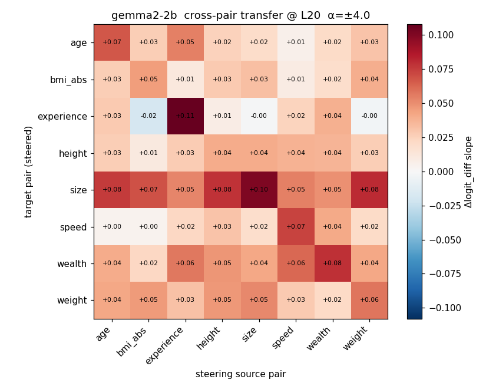
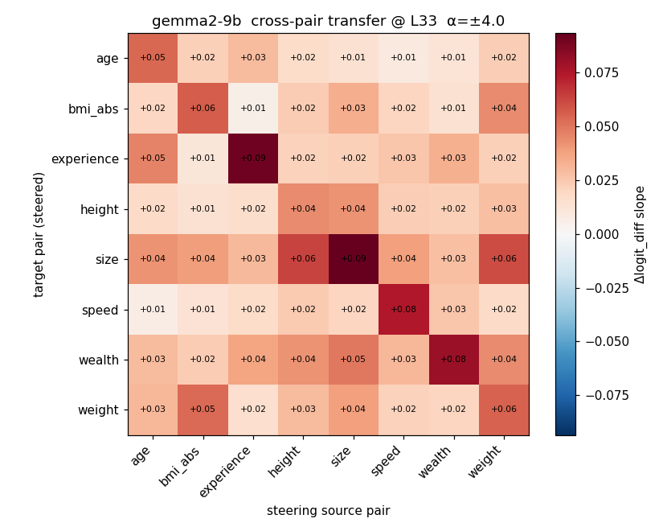

### 4. SAE features pass numeral controls and are more shared in 9B

The SAE analysis asks whether the z-looking features are actually just
"large number" or token-frequency features. For each pair, v11.5 takes the top
SAE features by R²(z) and then measures two controls:

- R²(x): does the feature track raw target value?
- R²(token): does the feature track numeric token / magnitude proxies?

The answer is mostly no. The top features have high R²(z) while R²(x) and
R²(token) are near zero. In Gemma 2 9B, the top feature averages about 0.68
R²(z) across pairs while both controls are near zero. This supports the
interpretation that these features respond to "above vs below the local norm",
not merely "large-looking number".

The same section also tracks feature sharing across adjective domains.
Cross-pair top-50 Jaccard: 2B = 0.11, 9B = **0.22** -- 9B has twice the
cross-pair SAE feature overlap. This is one of the more interesting scaling
results: the larger model appears to use a more shared SAE feature basis for
context-normalized scalar judgments. Most z-features activate monotonically with
z, with rare place-cell exceptions (e.g., v10 height feature 34700: bump
R^2=0.98, linear R^2=0.00).

Caveat: the current controls rule out raw x and numeric-token magnitude, but
not lexical/domain-feature interpretations. We have not yet audited whether
these SAE features also fire on words such as "tall", "short", "height", or
other adjective/domain tokens.

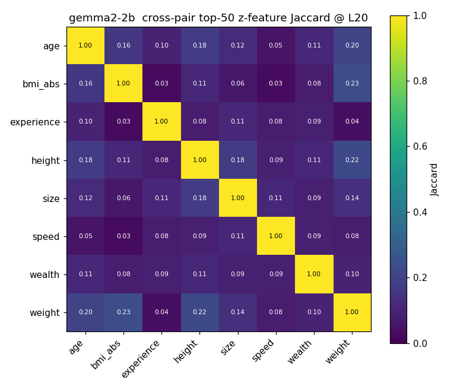
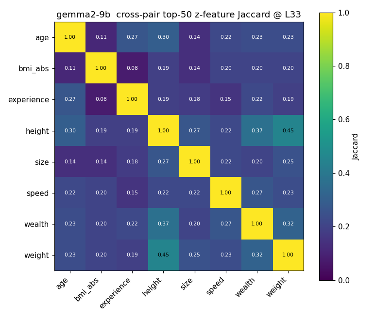

### 5. The z-code replicates across model scales

The 2B/9B comparison is a robustness check, not the core claim. The point is
that the same context-relative geometry appears in two different Gemma 2 scales,
with 9B making the harder pairs more uniform. PC1.R^2(z) on cell-means at the
canonical late layer (2B L20, 9B L33):

| pair       | 2B PC1.R^2(z) [95% CI]    | 9B PC1.R^2(z) [95% CI]    |
|---         |---                        |---                        |
| height     | **0.969** [0.961, 0.975]  | **0.928** [0.907, 0.941]  |
| weight     | **0.949** [0.933, 0.960]  | **0.944** [0.930, 0.954]  |
| bmi_abs    | **0.923** [0.876, 0.956]  | **0.784** [0.750, 0.813]  |
| experience | **0.901** [0.865, 0.928]  | **0.902** [0.846, 0.930]  |
| wealth     | **0.855** [0.768, 0.908]  | **0.871** [0.838, 0.897]  |
| speed      | 0.360 [0.015, 0.627]      | **0.428** [0.271, 0.582]  |
| age        | 0.209 [0.091, 0.341]      | **0.606** [0.003, 0.843]  |
| size       | 0.075 [0.000, 0.254]      | **0.656** [0.012, 0.853]  |

2B has median 0.90 but three pairs (age, size, speed) fail (R^2 < 0.4). 9B rescues all three (R^2 0.43-0.66). Bootstrap CIs confirm: 2B size [0.000, 0.254] is not statistically distinguishable from zero; 9B size [0.012, 0.853] is wide but nonzero. This is best read as cross-scale replication plus stronger uniformity in the larger model.

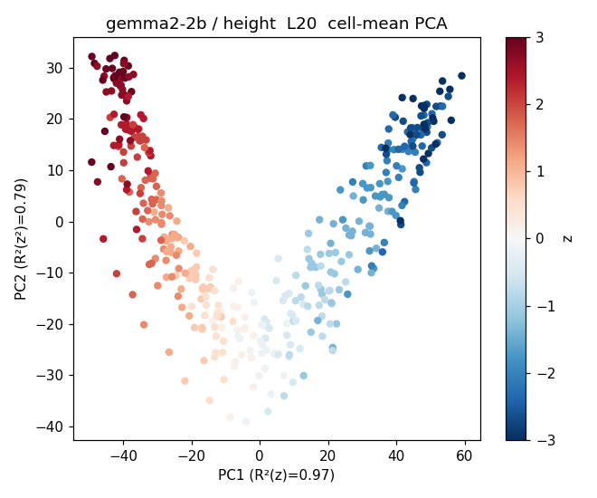
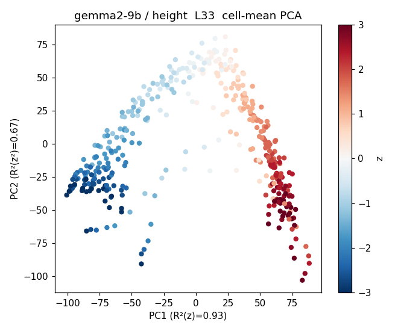

## Secondary Geometry Notes

v10's 400-cell dense grid resolves the manifold geometry more cleanly than the
earlier sparse grids: TWO-NN intrinsic dimensionality drops from 7.7 (L0) to 3.2
(L20), while PCA-95% variance peaks at L7 (16 components) then compresses to 7.
This is useful secondary evidence, but not a headline claim because intrinsic
dimension estimates are estimator- and sampling-sensitive. The point is that the
manifold becomes more compact with depth, not that we have identified a causal
mechanism from dimensionality alone.

Curvature evidence (v9 data, not re-tested in v10): for speed, isomap captures z
with R^2=0.97 while PCA gets R^2=0.01 -- z is on a curve that linear methods
miss.

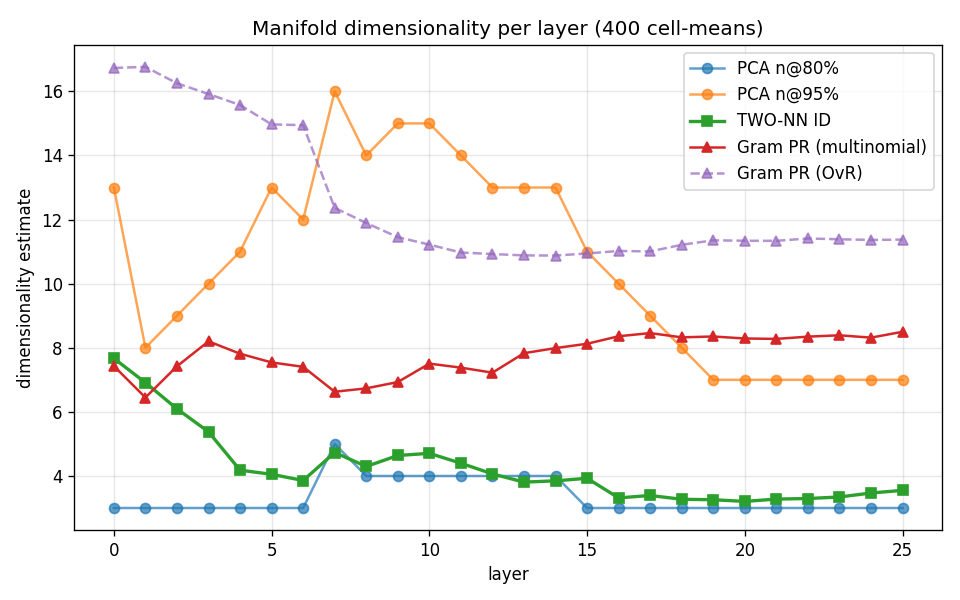

## Follow-ups and negatives

- **On-manifold tangent steering was not a clean win.** Tangent(z) steers at
  0.63-0.73x of primal_z; high-alpha entropy is sometimes lower, but the effect
  is modest.
- **Park's causal inner product was refuted.** `(W_U^T W_U)^-1 * probe_z` does
  not rotate probe toward primal: cos(probe_causal, primal) < 0.05 across pairs,
  layer choices, and lambda sweeps.
- **The causal head taxonomy was triple-refuted.** Single-head ablations are
  null, joint tagged-head ablations are null/helping, and permutation tests put
  most tag intersections at chance. Treat the taxonomy as correlational DLA, not
  a causal mechanism.
- **W_U orthogonality is a supporting control only.** `primal_z` is nearly
  orthogonal to `W_U[high] - W_U[low]`, so it is not trivially the final
  unembedding direction; this does not prove a mechanism.
- **Measurement warnings remain.** Fisher pullback was near-isotropic; the
  relative/absolute split was not significant; PC1~z is weak for size/speed at
  2B; speed and experience are pair-specific exceptions to shared steering;
  SAE-basis PCA is worse than raw PCA; the predicted increment-R^2 dip did not
  survive fold-aware residualization.
- **Direct-sign positive/negative results are follow-up only.** The
  prompt-sensitive open-ended estimate dropped on the valid forced-QA prompt, so
  this should not be used as a main relativity claim without top-K validation and
  cleaner forced-choice prompts.

## Repository layout

```
geometry-of-relativity/
  PLANNING.md          # Frozen project spec
  BUILDING.md          # Current active task
  APPENDIX.md          # Technical definitions and calculation details
  FINDINGS.md          # Full experimental log (v4-v9 ss1-ss13, v10 ss14, v11 ss15, v11.5 ss16)
  STATUS.md            # Project status summary and retraction list
  TODO.md              # Rolling task checklist
  scripts/
    vast_remote/       # GPU scripts (Vast.ai)
    analyze_v9_*.py    # v9 analysis scripts (CPU)
    plot_v9_*.py       # v9 plot scripts (CPU)
    plot_v11_*.py      # README/paper montage plots from existing JSON/PNG artifacts
    analyze_v10_*.py   # v10 analysis: dimensionality, SAE, attention, increment R^2
    plot_v10_*.py      # v10 behavioral plots
    gen_v10_*.py       # v10 prompt generation (dense height grid)
    gen_v11_dense.py   # v11 prompt generation (8 pairs x 2 models)
    analyze_v11_*.py   # v11 analysis: PCA, probing, SAE, head taxonomy, cross-pair transfer
    run_v11_*.sh       # v11 orchestration scripts
    analyze_v11_5_*.py # v11.5 analysis: shared z, multi-seed transfer, joint ablation, bootstrap CIs
    run_v11_5_all.sh   # v11.5 orchestrator
  results/             # JSON summaries (large activations on HF)
    v11/               # Per-model per-pair extraction outputs
    v11_5/             # Shared-z, transfer, ablation, bootstrap results
  figures/             # v7 (clean grid), v8 (replots), v9 (SAE + layer sweep), v10 (dense grid)
    v11/               # PCA, probing, SAE overlap, steering transfer matrices
  docs/                # Session plans, paper outline, archive
  src/                 # Core library
  tests/               # pytest suite
```

## Quick start

```bash
cp .env.example .env       # then edit .env to add HF_TOKEN at minimum
pip install -e ".[dev]"
pytest tests/ -v -m "not gpu"

# Fetch activation data from HF (private dataset; HF_TOKEN must have read access):
python scripts/fetch_from_hf.py
python scripts/fetch_from_hf.py --only v11   # v11 dense extraction (FINDINGS ss15)

# Regenerate plots (CPU only):
python scripts/plots_v7_behavioral.py
python scripts/replot_v7_from_json.py

# Re-run all v10 CPU analyses from the fetched NPZs:
python scripts/analyze_v10_dimensionality.py
python scripts/analyze_v10_increment_r2.py
python scripts/analyze_v10_sae.py
python scripts/analyze_v10_attention.py
python scripts/analyze_v10_attention_taxonomy.py
python scripts/plot_v10_behavioral.py

# Re-run all v11 CPU analyses:
python scripts/analyze_v11_pca.py
python scripts/analyze_v11_z_vs_lexical.py
python scripts/analyze_v11_cross_pair_transfer.py
python scripts/analyze_v11_sae.py
python scripts/analyze_v11_head_taxonomy_and_ablate.py

# Re-run all v11.5 analyses (shared z, transfer, ablation, bootstrap):
bash scripts/run_v11_5_all.sh
# Or individually:
python scripts/analyze_v11_5_shared_z.py
python scripts/analyze_v11_5_multiseed_transfer.py
python scripts/analyze_v11_5_joint_ablation.py
python scripts/analyze_v11_5_perm_null_taxonomy.py
python scripts/analyze_v11_5_p3c_fold_aware.py
python scripts/analyze_v11_5_p3d_widened.py
python scripts/analyze_v11_5_sae_token_freq.py
python scripts/analyze_v11_5_bootstrap_cis.py

# Regenerate README figures from committed artifacts:
python scripts/plot_v11_5_readme_story.py
python scripts/plot_v11_pca_montage_9b.py

# Re-run v10 from scratch on a GPU box (Gemma 2 2B; H100 ~2 min cached):
python scripts/gen_v10_dense_height.py
python scripts/vast_remote/extract_v10_dense_height.py
python scripts/vast_remote/exp_v10_layer_sweep_steering.py
```

## License

CC-BY-4.0 for the paper, MIT for the code.
