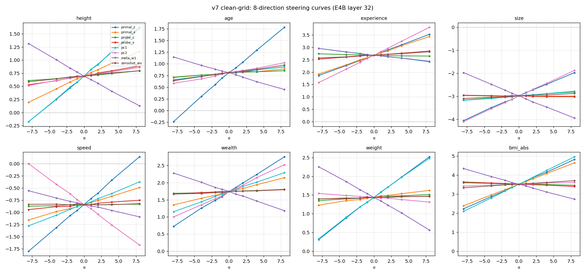
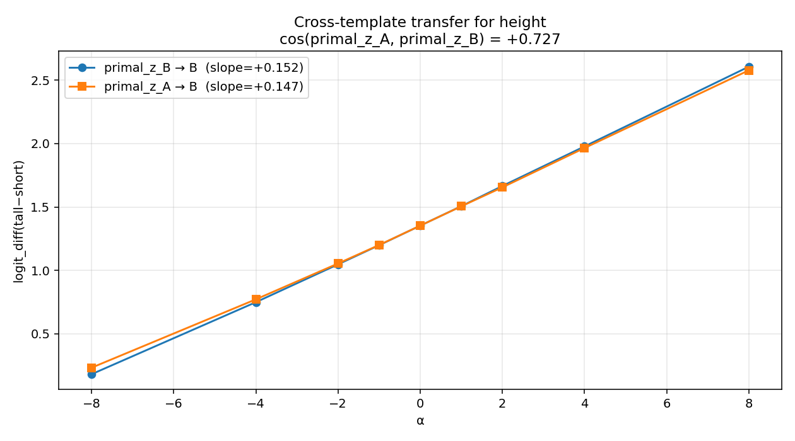
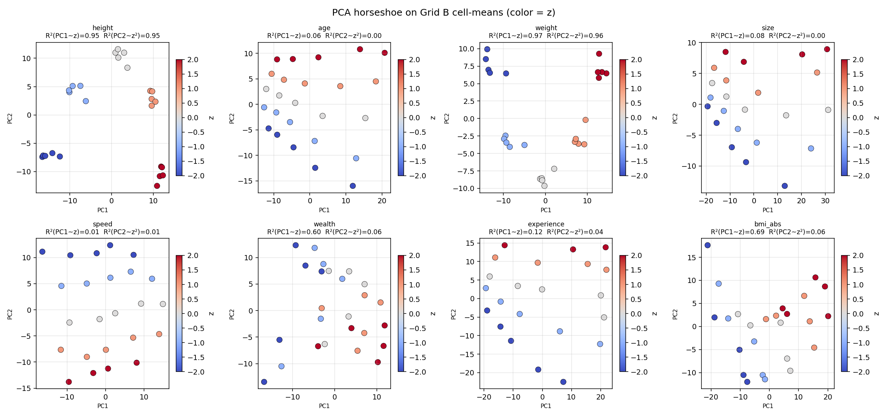
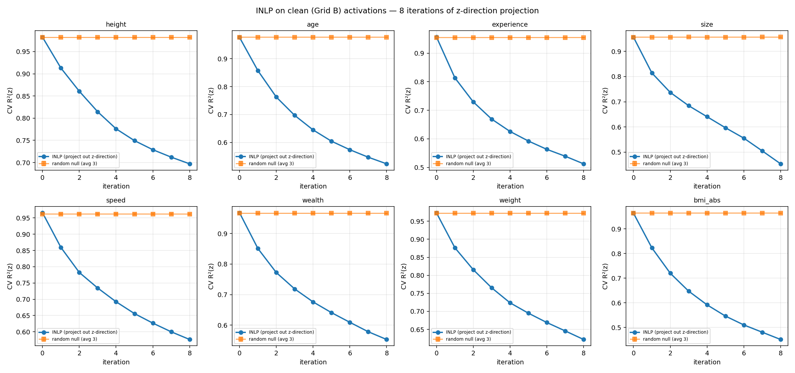
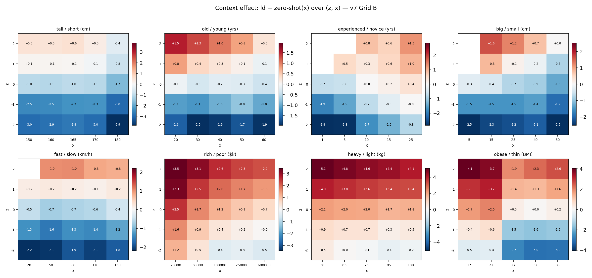
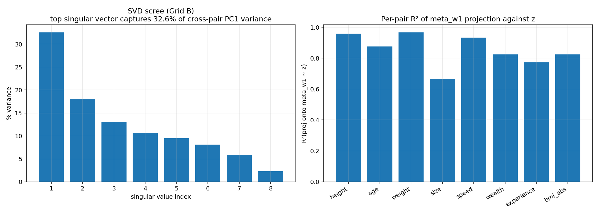

# geometry-of-relativity

Mechanistic interpretability study of **how LLMs represent contextual relativity** — whether "tall" means tall-for-this-group or tall-in-absolute-terms — via activation geometry and causal steering in Gemma 4.

**Target venue:** ICML 2026 MI Workshop (May 8 AOE), co-submission to NeurIPS 2026 main track.

## TL;DR

When a language model sees "Person 16: 170 cm. This person is ___", does it complete with "tall" based on the raw number (170 cm) or relative to the surrounding context (the other 15 people in the list)?

We find:
- **The model tracks both**, but organizes them differently: a simple mean-difference direction (`primal_z`) in activation space causally controls the adjective output, while the Ridge-regression probe direction (which optimally *decodes* z) has almost no causal effect.
- **This direction transfers across semantic domains** — the height z-direction steers weight judgments at 40% of own-pair strength, and transfers across prompt templates at 97%.
- **But the representation is heterogeneous** — for height/weight, the primary variance axis (PC1) tracks context-relative position; for age/speed, it tracks raw magnitude instead.

## Models

| Model | HuggingFace ID | Role |
|---|---|---|
| Gemma 4 E4B | `google/gemma-4-E4B` | Primary (42 layers, d=2560) |
| Gemma 4 31B | `google/gemma-4-31B` | Scaling comparison (60 layers, d=5376) |

## Setup

8 adjective pairs across semantic domains, each tested on a balanced (x, z) grid where x (raw value) and z (context-relative z-score) are independent by construction:

| Pair | Low / High | Unit | Behavior |
|---|---|---|---|
| height | short / tall | cm | PC1 = z |
| weight | light / heavy | kg | PC1 = z |
| wealth | poor / rich | $/yr | PC1 = z |
| bmi_abs | thin / obese | BMI | PC1 = z (absolute control) |
| age | young / old | years | PC1 = x |
| size | small / big | cm | PC1 = x |
| speed | slow / fast | km/h | PC1 = x |
| experience | novice / expert | years | PC1 = x |

Per pair: 5 x-values x 5 z-values x 30 seeds = 750 prompts. Activations extracted at layer 32 (late) of E4B.

## Key findings

### 1. Encoding != Use: primal_z steers 18x stronger than probe_z

The mean-difference direction between high-z and low-z activations (`primal_z`) shifts logit_diff 13-18x more per unit than the Ridge regression probe direction (`probe_z`). The model *encodes* z-score information across many dimensions (Ridge R² > 0.97), but *uses* it for adjective prediction via a geometrically simple axis.



### 2. Cross-pair transfer at 40% own-pair strength

Steering with pair A's primal_z direction on pair B's prompts works at 40% of own-pair effectiveness (5.5x random null). Body-measurement pairs (height, weight, bmi_abs) form a tight cluster with near-complete mutual transfer (0.10-0.13 slope, close to own-pair 0.13).


### 3. Cross-template transfer at 97%

For height, primal_z extracted from template A ("This person is") steers template B ("Among the individuals listed, the one measuring X cm would be described as") at 97% of self-steering strength and 44x above random null. The z-direction encodes semantics, not syntax.



### 4. PCA geometry is heterogeneous, not universal

On the clean grid, PC1 tracks z (context position) for height, weight, wealth, and bmi_abs — but tracks x (raw magnitude) for age, size, speed, and experience. The v4 "universal horseshoe" was an artifact of a design confound.



### 5. INLP confirms z is a removable feature

Iteratively projecting out the z-direction drops CV R²(z) by 30-50% in 8 iterations, while random projections have no effect. The z-information is concentrated in a low-dimensional subspace, not diffusely spread.



### 6. Behavioral relativity: context shifts adjective judgments

After subtracting zero-shot bias, the logit_diff heatmap shows a strong z-gradient (horizontal bands) with minimal residual x-dependence — the context effect is real and not driven by the model's prior.



### 7. Meta-direction captures 33% shared variance

SVD of stacked per-pair PC1s yields a single shared direction (`meta_w1`) capturing 32.6% of cross-pair variance (vs 12.5% chance baseline). This direction predicts z with R² = 0.67-0.97 across all 8 pairs, but the shared structure is weaker than initially estimated on the confounded grid.



## Honest negatives

- **Fisher pullback (H4) refuted.** F(h) is near-isotropic at tested activations; Fisher-adjusted cosines match Euclidean within 0.01-0.04. The Fisher metric doesn't separate relative from absolute adjectives.
- **Relative/absolute dichotomy not significant.** With n=7 relative + n=4 absolute pairs, Welch t = -0.33, p = 0.75. The "absolute" control bmi_abs shows context sensitivity too.
- **Logit_diff R measurements require top-K validation.** The pos/neg R=0.47 was inflated by scoring on tokens outside the model's top-10. On the only valid prompt variant (forced Q/A), R drops to 0.31.
- **Cross-pair PC1 cosines are modest.** Mean off-diagonal |cos| = 0.19 on clean grid (was 0.32 on confounded grid). The shared substrate exists but is weaker than originally reported.

## Methodological contribution

The v4-v6 experiments used a (x, mu) grid where z was derived, creating corr(x, z) = 0.58-0.86. Every direction-based analysis (PCA, primal vectors, probes) was contaminated. The v7 clean grid (iterate x, z independently; derive mu) fixed this and revealed which findings were artifacts vs genuine. **Lesson: when studying derived variables like z-scores, the experimental grid must make the variables of interest independent by construction.**

## Repository layout

```
geometry-of-relativity/
  PLANNING.md          # Frozen project spec
  BUILDING.md          # Current active task
  FINDINGS.md          # Full experimental findings (v4-v8)
  scripts/
    plots_v7_behavioral.py     # Behavioral plots from v7 Grid B
    replot_v7_from_json.py     # Geometry plots from pre-computed JSON
    fetch_from_hf.py           # Fetch data from HF dataset
    vast_remote/               # GPU scripts (run on Vast.ai)
  results/                     # JSON summaries + CSVs (large files on HF)
  figures/                     # All plots (v7 = clean grid, v8 = replots + new)
  docs/                        # Design docs, paper outline, archived session logs
  src/                         # Core library (data_gen, fisher, probe, plots)
  tests/                       # pytest suite
```

## Quick start

```bash
pip install -e ".[dev]"       # CPU-only
pytest tests/ -v -m "not gpu"

# Regenerate all plots (CPU, no GPU needed):
python scripts/plots_v7_behavioral.py
python scripts/replot_v7_from_json.py

# Fetch activation data from HF (needed for PCA/probe scripts):
python scripts/fetch_from_hf.py
```

## License

CC-BY-4.0 for the paper, MIT for the code.
