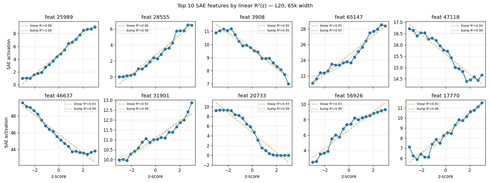
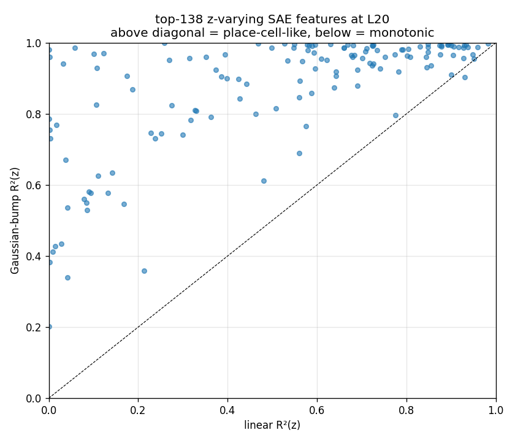
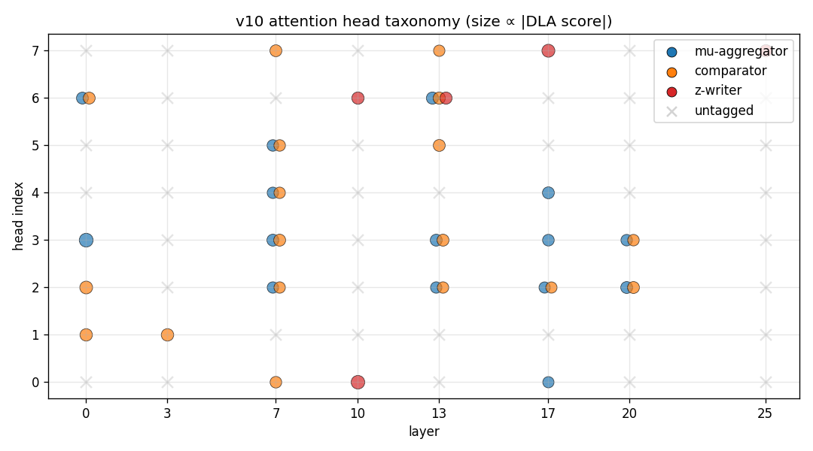
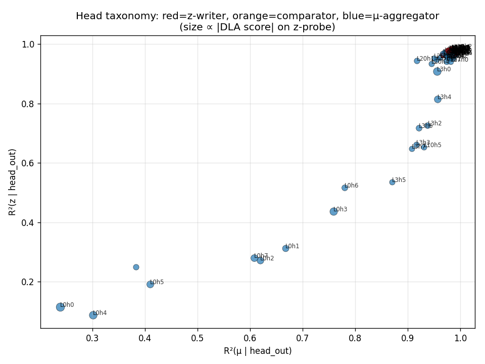

# geometry-of-relativity

Mechanistic interpretability study of **how LLMs represent contextual relativity** — whether "tall" means tall-for-this-group or tall-in-absolute-terms — via activation geometry, causal steering, and SAE decomposition in Gemma.

**Target venue:** ICML 2026 MI Workshop (May 8 AOE), co-submission to NeurIPS 2026 main track.

## TL;DR

When a language model sees "Person 16: 170 cm. This person is ___", does it complete with "tall" based on the raw number (170 cm) or relative to the surrounding context (the other 15 people)?

We find:
- **The model tracks context-relative z-scores** with R = 0.77–1.03 across 8 adjective pairs on two models (Gemma 4 E4B, Gemma 2 2B).
- **Encoding != Use**: z is decodable from layer 7, but the network only *reads* it causally from layer 13 onward, peaking at **layer 14** (v10 dense grid). A simple mean-difference direction (`primal_z`) steers adjective output 10–100x stronger than the Ridge probe direction, with the probe/primal gap widening to ~8x in late layers.
- **z representation compresses monotonically.** TWO-NN intrinsic dimensionality drops from 7.7 (L0) to 3.2 (L20); PCA-95% peaks at L7 (16 components) then compresses to 7. The v9 "hunchback" (ID peaking mid-network) was a 25-point TWO-NN artefact resolved by v10's 400-cell dense grid.
- **Three alternative explanations fail**: sparse SAE decomposition, on-manifold tangent steering, and Park's causal inner product all fail to bridge the encoding-vs-use gap.

## Models

| Model | HuggingFace ID | Role |
|---|---|---|
| Gemma 2 2B | `google/gemma-2-2b` | Primary + SAE analysis via Gemma Scope |
| Gemma 4 E4B | `google/gemma-4-E4B` | Original extraction (42 layers, d=2560) |
| Gemma 4 31B | `google/gemma-4-31B` | Scaling comparison (60 layers, d=5376) |

## Setup

8 adjective pairs, each tested on a balanced (x, z) grid where x (raw value) and z (context-relative z-score) are independent by construction. Per pair: 5 x-values x 5 z-values x 30 seeds = 750 prompts.

| Pair | Adjectives | R (Gemma 2 2B) |
|---|---|---|
| height | short / tall | 0.85 |
| age | young / old | 1.03 |
| weight | light / heavy | 0.92 |
| size | small / big | 0.93 |
| speed | slow / fast | 0.77 |
| wealth | poor / rich | 0.77 |
| experience | novice / expert | 0.86 |
| bmi_abs | thin / obese | 0.83 |

v10 goes deep on *height* with a 20x20 dense grid (400 cells, 4000 prompts) to stress-test dimensionality and steering results at higher resolution.


## Key findings

### 1. Encoding != Use is a layer-depth phenomenon (the headline result)

z is decodable (R² = 0.94) from layer 7, but primal_z steering is zero at layers 5–10. Causal potency emerges at layer 13, peaks at **layer 14** (v10 dense grid), and the probe/primal gap widens to ~8x in late layers. **The dimensions that encode z early are not the dimensions downstream layers read from.**

The full 26-layer sweep reveals a three-phase computation:

| Phase | Layers | What happens |
|---|---|---|
| **Encode** | L0–L7 | z computed from tokens. R²(z) ramps 0.45→0.94. primal_z direction actively rotates (cos ≈ 0.3–0.5 between adjacent layers). |
| **Compute** | L7–L14 | Direction continues rotating. Causal potency emerges at L13, peaks at L14. ‖primal_z‖ grows 10x. |
| **Broadcast** | L15–L25 | Direction locks (cos > 0.9). ‖primal_z‖ amplified further (total 400x from L0). Probe/primal gap widens to ~8x. |

The primal_z direction is not a static feature — it's the endpoint of a ~90° arc the model traces through activation space over 10+ layers of computation, then amplifies for readout. v10's dense grid (400 cells) confirms peak steering at L14, revising the v9 estimate of L20–22.


### 2. z representation compresses monotonically

v10's 400-cell dense grid resolves the manifold geometry clearly: TWO-NN intrinsic dimensionality drops monotonically from 7.7 (L0) to 3.2 (L20). PCA-95% variance peaks at L7 (16 components) then compresses to 7. The v9 "hunchback" pattern (ID peaking mid-network at ~7) was a 25-point TWO-NN artefact that disappears with denser sampling.

Curvature evidence (v9 data, not re-tested in v10): for speed, isomap captures z with R²=0.97 while PCA gets R²=0.01 — z is on a curve that linear methods miss.


### 3. Cross-pair transfer at 40% own-pair strength

Steering with pair A's primal_z direction on pair B's prompts works at 40% of own-pair effectiveness (5.5x random null). Cross-template transfer reaches 97% (44x null). The z-direction encodes semantics, not syntax.


### 4. z-variance concentrates in ~138 of 65k SAE features

Using Gemma Scope SAEs (65k features, layer 20) on the v10 dense grid, only ~138 features carry meaningful z-variance — far sparser than the v9 estimate of "thousands." primal_z remains 4–10x more concentrated than probe_z in the decoder-row basis, but the overall picture is much sparser than previously reported.


### 5. SAE features are mostly linear in z, with one genuine place-cell

Most z-correlated SAE features activate **monotonically** with z (r = 0.7–0.9), not as localized bumps. However, v10 reveals one genuine place-cell exception: feature 34700 (bump R²=0.98, linear R²=0.00) — a highly localized activation tuned to a narrow z range. The context-relative representation is predominantly continuous, with rare discrete exceptions.




### 6. primal_z direction rotates through a ~90° arc mid-network, then stabilizes

cos(primal_z[L], primal_z[L-1]) starts at 0.3 (early layers — active rotation), reaches 0.88+ by layer 18, and stabilizes. The "mid ⊥ late" finding from earlier is explained: primal_z sweeps through ~90° over the middle layers, then settles into its final orientation.

### 7. Attention head taxonomy: 38 heads across 8 layers implement z-computation

v10 identifies three functional classes of attention heads via DLA (direct logit attribution) and attention-pattern analysis across 8 strategic layers:

| Class | Count | Role | Standout |
|---|---|---|---|
| **mu-aggregators** | 15 | Attend broadly to context members, computing running means | — |
| **Comparators** | 18 | Attend to target vs. context, computing deviation signals | L13h2 |
| **z-writers** | 5 | Project comparison output toward the adjective logit | — |

L13h2 is the standout comparator head, consistent with causal potency emerging at L13. DLA faithfulness (correlation between DLA-predicted and actual logit-diff) is 0.67.




## Three hypotheses tested and refuted

### On-manifold tangent steering

Tangent(z) steers at 0.63–0.73x of primal_z. At low α, entropy damage is similar; at high α (=8), tangent is kinder on 6/8 pairs but the effect is modest (0.1–0.6 nats). Not the clean win predicted.

### Park's causal inner product

(W_U^T W_U)^{-1} · probe_z does NOT rotate probe toward primal. cos(probe_causal, primal) < 0.05 across all pairs, at both layer 20 and the theoretically-favored layer 25, across a λ sweep from 10^-5 to 10.

### Sparse SAE decomposition

z is not carried by a handful of SAE features. primal_z is 4–10x more concentrated than probe_z but still fires ~3–8k effective features in the 65k dictionary. The encoding-vs-use gap is finer-grained than SAE sparsity.

## Honest negatives

- **Fisher pullback (H4) refuted.** F(h) near-isotropic at tested activations.
- **Relative/absolute dichotomy not significant** (n=7 vs 4, p=0.75).
- **Cross-pair PC1 cosines modest** (0.19 on clean grid). Shared substrate is real but weak.
- **logit_diff R requires top-K validation.** Pos/neg R=0.47 dropped to R=0.31 on the only valid prompt.
- **SAE-basis PCA is worse than raw PCA** for recovering z (catastrophic for curved-manifold pairs like speed).
- **Increment R² dip not observed.** The predicted encode/re-encode dip (where per-layer increment R² should drop as the model re-encodes z into a new basis) does not exist; increment R² tracks cumulative R² almost perfectly.

## Repository layout

```
geometry-of-relativity/
  PLANNING.md          # Frozen project spec
  BUILDING.md          # Current active task
  FINDINGS.md          # Full experimental findings (v4-v9 §1-§13, v10 §14)
  scripts/
    vast_remote/       # GPU scripts (Vast.ai)
    analyze_v9_*.py    # v9 analysis scripts (CPU)
    plot_v9_*.py       # v9 plot scripts (CPU)
    analyze_v10_*.py   # v10 analysis: dimensionality, SAE, attention, increment R²
    plot_v10_*.py      # v10 behavioral plots
    gen_v10_*.py       # v10 prompt generation (dense height grid)
  results/             # JSON summaries (large activations on HF)
  figures/             # v7 (clean grid), v8 (replots), v9 (SAE + layer sweep), v10 (dense grid)
  docs/                # Session plans, paper outline, archive
  src/                 # Core library
  tests/               # pytest suite
```

## Quick start

```bash
cp .env.example .env       # then edit .env to add HF_TOKEN at minimum
pip install -e ".[dev]"
pytest tests/ -v -m "not gpu"

# Fetch activation data from HF (private dataset; HF_TOKEN must have read access):
python scripts/fetch_from_hf.py
python scripts/fetch_from_hf.py --only v10   # latest run (FINDINGS §14)

# Regenerate plots (CPU only):
python scripts/plots_v7_behavioral.py
python scripts/replot_v7_from_json.py

# Re-run all v10 CPU analyses from the fetched NPZs:
python scripts/analyze_v10_dimensionality.py
python scripts/analyze_v10_increment_r2.py
python scripts/analyze_v10_sae.py
python scripts/analyze_v10_attention.py
python scripts/analyze_v10_attention_taxonomy.py
python scripts/plot_v10_behavioral.py

# Re-run v10 from scratch on a GPU box (Gemma 2 2B; H100 ~2 min cached):
python scripts/gen_v10_dense_height.py
python scripts/vast_remote/extract_v10_dense_height.py
python scripts/vast_remote/exp_v10_layer_sweep_steering.py
```

## License

CC-BY-4.0 for the paper, MIT for the code.
