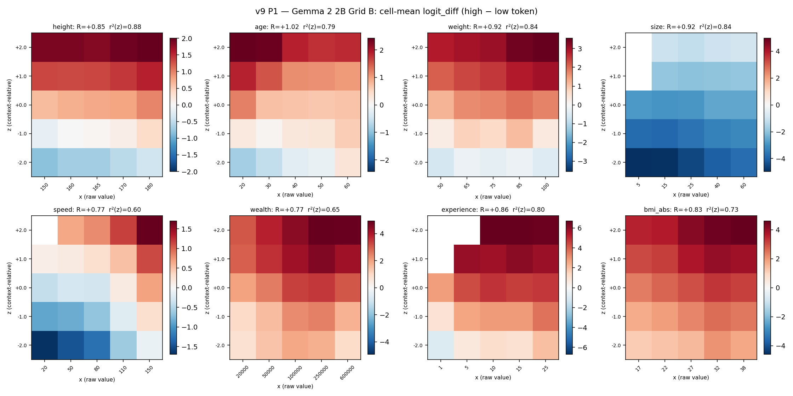
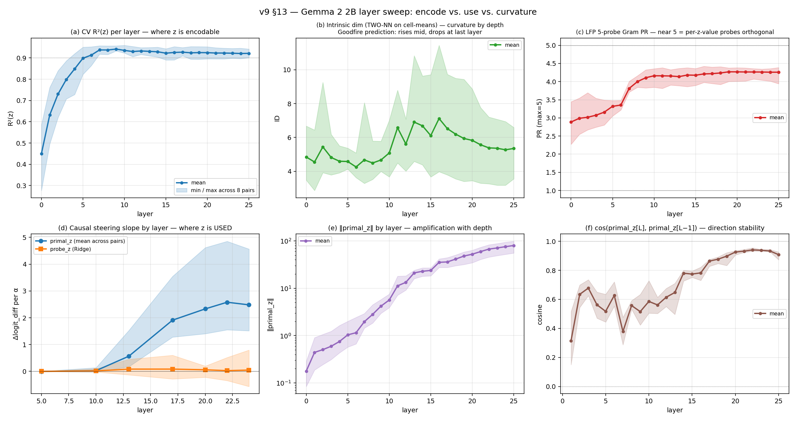
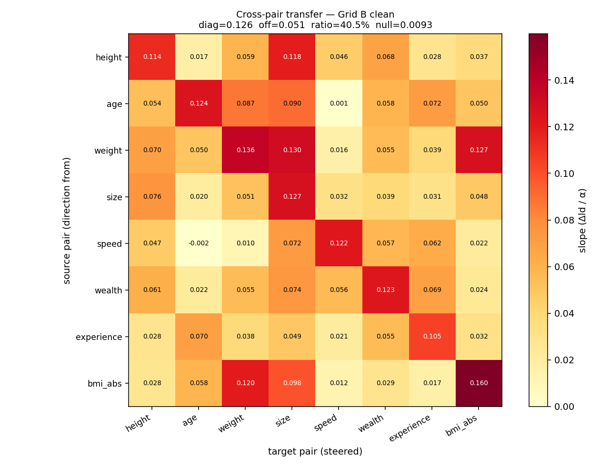
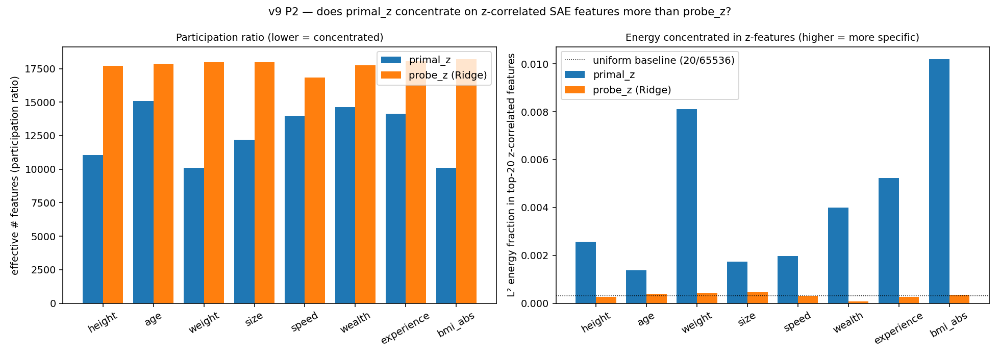
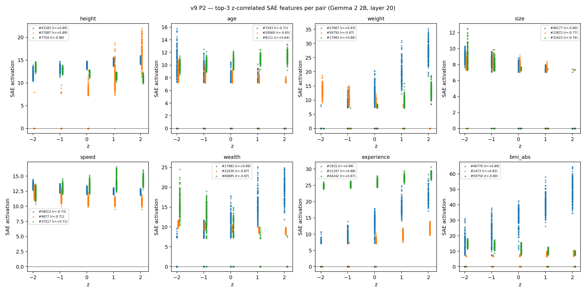

# geometry-of-relativity

Mechanistic interpretability study of **how LLMs represent contextual relativity** — whether "tall" means tall-for-this-group or tall-in-absolute-terms — via activation geometry, causal steering, and SAE decomposition in Gemma.

**Target venue:** ICML 2026 MI Workshop (May 8 AOE), co-submission to NeurIPS 2026 main track.

## TL;DR

When a language model sees "Person 16: 170 cm. This person is ___", does it complete with "tall" based on the raw number (170 cm) or relative to the surrounding context (the other 15 people)?

We find:
- **The model tracks context-relative z-scores** with R = 0.77–1.03 across 8 adjective pairs on two models (Gemma 4 E4B, Gemma 2 2B).
- **Encoding != Use**: z is decodable from layer 7, but the network only *reads* it causally from layer 13 onward, peaking at layer 20–22. A simple mean-difference direction (`primal_z`) steers adjective output 10–100x stronger than the Ridge probe direction.
- **z lives on a ~5-D curved manifold**, not a 1-D line. Intrinsic dimensionality peaks mid-network (~7 at L13–17) and compresses to ~5 at the final layer — matching Goodfire's predictions for belief manifolds.
- **Three alternative explanations fail**: sparse SAE decomposition, on-manifold tangent steering, and Park's causal inner product all fail to bridge the encoding-vs-use gap.

## Models

| Model | HuggingFace ID | Role |
|---|---|---|
| Gemma 2 2B | `google/gemma-2-2b` | Primary + SAE analysis via Gemma Scope |
| Gemma 4 E4B | `google/gemma-4-E4B` | Original extraction (42 layers, d=2560) |
| Gemma 4 31B | `google/gemma-4-31B` | Scaling comparison (60 layers, d=5376) |

## Setup

8 adjective pairs, each tested on a balanced (x, z) grid where x (raw value) and z (context-relative z-score) are independent by construction. Per pair: 5 x-values x 5 z-values x 30 seeds = 750 prompts.

| Pair | Adjectives | R (Gemma 2 2B) |
|---|---|---|
| height | short / tall | 0.85 |
| age | young / old | 1.03 |
| weight | light / heavy | 0.92 |
| size | small / big | 0.93 |
| speed | slow / fast | 0.77 |
| wealth | poor / rich | 0.77 |
| experience | novice / expert | 0.86 |
| bmi_abs | thin / obese | 0.83 |



## Key findings

### 1. Encoding != Use is a layer-depth phenomenon

z is decodable (R² = 0.94) from layer 7, but primal_z steering is zero at layers 5–10. Causal potency emerges at layer 13 (slope 0.57), peaks at layers 20–22 (slope 2.3–2.6), and the probe/primal gap widens to 0.03x. **The dimensions that encode z early are not the dimensions downstream layers read from.**



### 2. z lives on a ~5-D curved manifold

Intrinsic dimensionality (TWO-NN) reveals z occupies a ~5-D manifold at the late layer, peaking at ~7 mid-network then compressing — matching Goodfire/Sarfati et al.'s predictions. For speed, isomap captures z with R²=0.97 while PCA gets R²=0.01 — z is on a curve that linear methods completely miss.

### 3. Cross-pair transfer at 40% own-pair strength

Steering with pair A's primal_z direction on pair B's prompts works at 40% of own-pair effectiveness (5.5x random null). Cross-template transfer reaches 97% (44x null). The z-direction encodes semantics, not syntax.



### 4. primal_z is more concentrated than probe_z in SAE basis (but not sparse)

Using Gemma Scope SAEs (65k features, layer 20), primal_z has 4–10x lower participation ratio than probe_z in the decoder-row basis. But both still spread across thousands of features. The top-20 z-correlated SAE features show only 6% cross-pair Jaccard overlap — each pair uses mostly different features.



### 5. SAE features are linear in z, not place-cells

Unlike Anthropic's character-count manifold (discretized by place-cell features), z-correlated SAE features activate **monotonically** with z (r = 0.7–0.9), not as localized bumps. The context-relative representation is continuous, not discretized.



### 6. primal_z direction rotates through a ~90° arc mid-network, then stabilizes

cos(primal_z[L], primal_z[L-1]) starts at 0.3 (early layers — active rotation), reaches 0.88+ by layer 18, and stabilizes. The "mid ⊥ late" finding from earlier is explained: primal_z sweeps through ~90° over the middle layers, then settles into its final orientation.

## Three hypotheses tested and refuted

### On-manifold tangent steering

Tangent(z) steers at 0.63–0.73x of primal_z. At low α, entropy damage is similar; at high α (=8), tangent is kinder on 6/8 pairs but the effect is modest (0.1–0.6 nats). Not the clean win predicted.

### Park's causal inner product

(W_U^T W_U)^{-1} · probe_z does NOT rotate probe toward primal. cos(probe_causal, primal) < 0.05 across all pairs, at both layer 20 and the theoretically-favored layer 25, across a λ sweep from 10^-5 to 10.

### Sparse SAE decomposition

z is not carried by a handful of SAE features. primal_z is 4–10x more concentrated than probe_z but still fires ~3–8k effective features in the 65k dictionary. The encoding-vs-use gap is finer-grained than SAE sparsity.

## Honest negatives

- **Fisher pullback (H4) refuted.** F(h) near-isotropic at tested activations.
- **Relative/absolute dichotomy not significant** (n=7 vs 4, p=0.75).
- **Cross-pair PC1 cosines modest** (0.19 on clean grid). Shared substrate is real but weak.
- **logit_diff R requires top-K validation.** Pos/neg R=0.47 dropped to R=0.31 on the only valid prompt.
- **SAE-basis PCA is worse than raw PCA** for recovering z (catastrophic for curved-manifold pairs like speed).

## Repository layout

```
geometry-of-relativity/
  PLANNING.md          # Frozen project spec
  BUILDING.md          # Current active task
  FINDINGS.md          # Full experimental findings (v4-v9, §1-§13)
  scripts/
    vast_remote/       # GPU scripts (Vast.ai)
    analyze_v9_*.py    # v9 analysis scripts (CPU)
    plot_v9_*.py       # v9 plot scripts (CPU)
  results/             # JSON summaries (large activations on HF)
  figures/             # v7 (clean grid), v8 (replots), v9 (SAE + layer sweep)
  docs/                # Session plans, paper outline, archive
  src/                 # Core library
  tests/               # pytest suite
```

## Quick start

```bash
pip install -e ".[dev]"
pytest tests/ -v -m "not gpu"

# Fetch activation data from HF:
python scripts/fetch_from_hf.py

# Regenerate plots (CPU only):
python scripts/plots_v7_behavioral.py
python scripts/replot_v7_from_json.py
```

## License

CC-BY-4.0 for the paper, MIT for the code.
