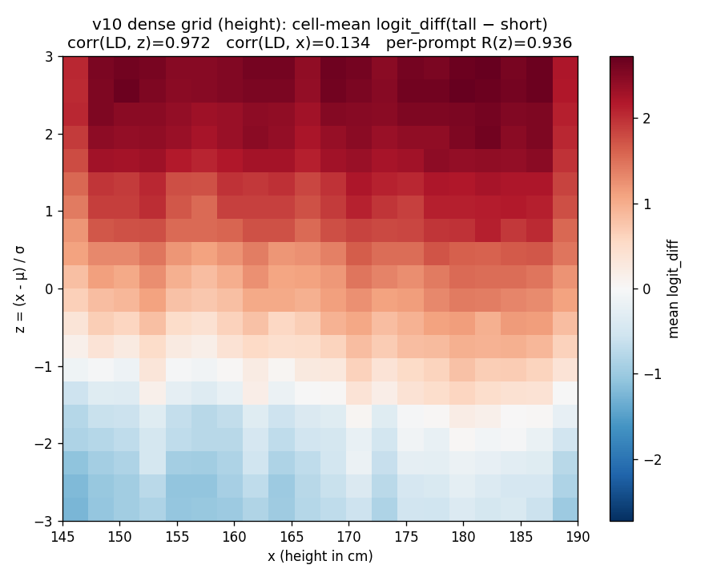
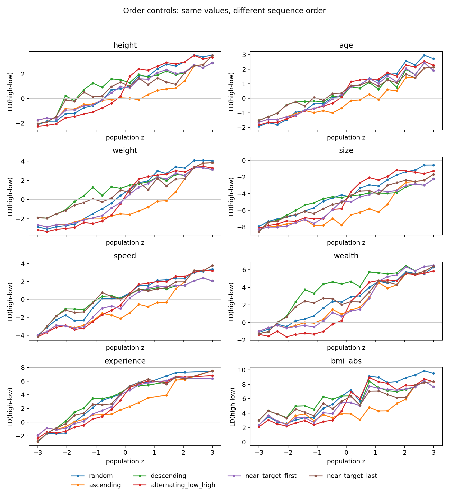
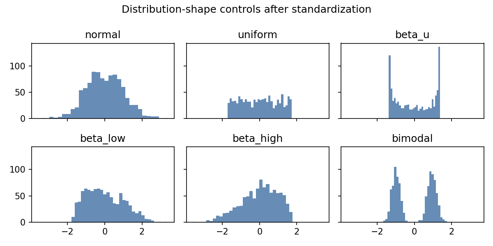
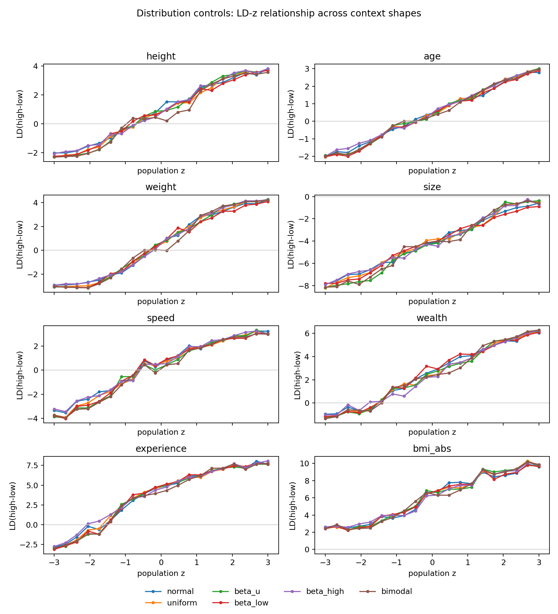
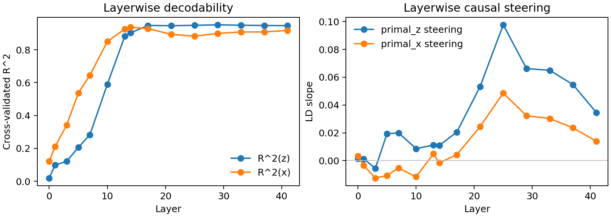
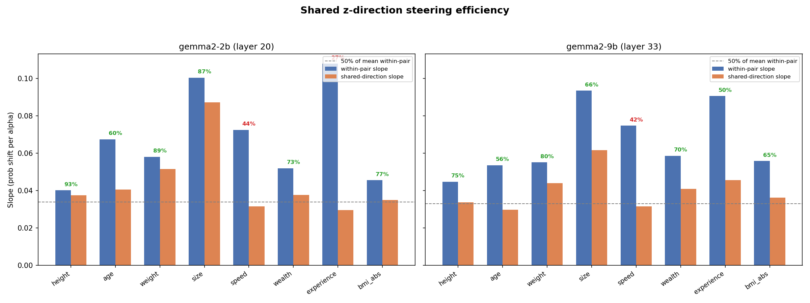
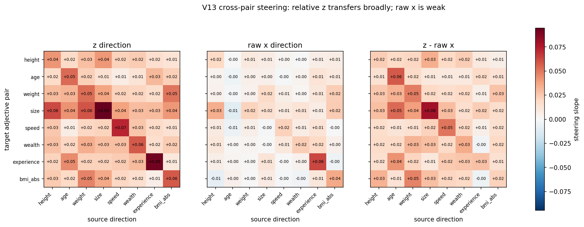

# geometry-of-relativity

Code, results, and figures for **The Geometry of Relativity: Context-Relative
Scalar Representations in LLMs**.

The paper studies whether language models mirror a basic property of human
scalar judgment: words such as *tall*, *short*, *rich*, or *fast* are not
determined by a raw number alone, but by how that number stands relative to a
comparison class. In the experiments, prompts provide reference values, and the
model's high-minus-low adjective logit difference is measured against both raw
magnitude and context-normalized standing.

The README follows the submitted paper's core flow: experiment design,
behavioral results, mechanistic results, discussion/limitations, and
reproducibility. It also points to older and follow-up experiment artifacts where
they help reproduce or stress-test the paper claims.

## TL;DR

- **LLMs show context-relative scalar judgment.** With a comparison class in
  the prompt, Gemma 2 9B adjective logits are governed primarily by
  context-normalized standing `z`, not by raw value `x`.
- **One reference is already enough to change the regime.** With no reference
  values, the model behaves more like a raw-magnitude reader. With one reference
  value, it becomes comparator-like; with richer comparison classes, the
  readout becomes smoother and more graded.
- **The behavior is robust but not context-invariant.** Reference order and
  distribution shape modulate confidence. The model shows recency effects under
  sorted orders and local-cluster effects under bimodal contexts.
- **The representation is visible inside the model.** Both `x` and `z` are
  linearly decodable from residual-stream activations, but steering along a
  `d_z` direction is more effective at changing adjective logits than steering
  along `d_x`.
- **The mechanism is partly shared across concepts.** Shared and leave-one-out
  `d_z` directions transfer across adjective domains more consistently than
  raw-`x` directions, but the result is not a single universal vector.
- **Causal interventions support functional use.** Mean-difference steering,
  manifold-informed steering, and attention-head resampling all provide
  evidence that relative standing is causally relevant, with important
  limitations described below.

## Experiment Design

For each prompt, the project separates the raw target value, the prompt context,
and the target's relative standing:

- `x`: raw target value, such as `170 cm`.
- `mu`: mean of the reference values in the prompt.
- `sigma`: spread of the reference values.
- `z = (x - mu) / sigma`: context-normalized standing.
- `LD`: high-minus-low adjective logit difference, for example
  `logit("tall") - logit("short")`.

A model using only `x` says that `170 cm` is tall or short independent of the
comparison class. A model using `z` says that `170 cm` can be tall in a short
group, average in an average group, and short in a very tall group.

The primary paper-facing figures and tables emphasize `google/gemma-2-9b`; the
repository also contains Gemma 2 2B/9B cross-scale artifacts and broader
follow-up runs. The main scalar adjective domains are:

| Concept | Unit | Low / High | Context spread | Target range |
|---|---|---|---:|---|
| Height | cm | short / tall | 10 | 147-183 |
| Age | years | young / old | 5 | 16-64 |
| Weight | kg | light / heavy | 8 | 45-105 |
| Size | cm diameter | small / big | 6 | 0.5-65.5 |
| Speed | km/h | slow / fast | 15 | 7-163 |
| Income | log(USD/year) | poor / rich | log 2 | $14k-$900k |
| Experience | years | novice / expert | 4 | 0.5-27.4 |
| BMI | kg/m^2 | thin / obese | 3 | 14.9-40.1 |

Prompt construction samples `x` and `z` independently, then derives the context
mean needed to make the target have that relative standing. This avoids the
cheap confound where raw magnitude and relative standing accidentally move
together.

## Behavioral Results

### 3.1 Adjective Judgments Track `z` Over `x`

Across the eight domains, the cell-mean logit difference correlates strongly
with `z` and much more weakly with `x`:

| Concept | corr(LD, z) | corr(LD, x) |
|---|---:|---:|
| Height | **0.976** | 0.107 |
| Age | **0.940** | -0.002 |
| Weight | **0.967** | 0.114 |
| Size | **0.928** | 0.366 |
| Speed | **0.930** | 0.412 |
| Income | **0.964** | 0.260 |
| Experience | **0.951** | 0.356 |
| BMI | **0.954** | 0.216 |

The dense height grid is the simplest visual anchor: once context is present,
LD varies mainly with `z`, not raw `x`.



The table above is the submitted paper's behavioral summary. Supporting paths:

- `results/v10/behavioral_summary.json`
- `FINDINGS.md`
- `docs/paper_outline.md`
- `figures/v10/behavioral_logit_diff_xz.png`
- `figures/v11/pca/montage_gemma2-9b_2d_L33.png`

### 3.2 Sensitivity to the Number of Reference Values

The paper's reference-count result is not that "more examples make relativity
stronger" in a simple monotone sense. Instead:

- With `k = 0`, the model has no explicit comparison class and falls back toward
  raw-value behavior.
- With `k = 1`, behavior immediately shifts into a comparator-like relative
  regime.
- With larger `k`, the LD-by-`z` curve becomes smoother and more graded, and the
  model partially reintegrates objective anchoring.

This is one of the clearest human-like effects: a single comparison can define
a local standard, while richer contexts support more graded calibration.

Supporting paths:

- `internal/kshot/phase/figures/p2a_shot_sweep.png`
- `internal/kshot/phase/figures/p2d_phase_grid_partial.png`
- `internal/kshot/phase/results/p2a_summary.json`
- `internal/kshot/phase/results/p2d_l0all_per_k_gemma2-9b_height.json`

### 3.3 Sensitivity to Reference Order

The model does not process the reference multiset as a perfectly symmetric
statistic. Holding values fixed and changing their order changes the level and
smoothness of the LD-by-`z` curve.

The main interpretation is recency bias. For example, ascending contexts place
large values near the end, locally inflating the comparison class and lowering
the high-adjective logit. Alternating low/high contexts make the range more
salient and can induce sharper comparator-like transitions.



Supporting paths:

- `results/v14/order/`
- `results/v14_1/order/`
- `figures/v14/order/order_ld_by_z_lines.png`
- `figures/v14_1/order/order_ld_by_z_lines.png`

### 3.4 Sensitivity to Distribution Shape

Normal and bimodal contexts both preserve the broad `z` relationship, but they
do not induce identical confidence dynamics. In bimodal contexts, values between
or near modes can be judged relative to a local cluster rather than only the
global mean, producing flatter or sharper regions in the LD-by-`z` curve.





Supporting paths:

- `results/v14/distribution/`
- `figures/v14/distribution/distribution_shape_examples.png`
- `figures/v14/distribution/distribution_ld_by_z_lines.png`
- `results/v14/summary.md`

## Mechanistic Results

### 4.1 Relative Standing Is Linearly Encoded

For each adjective pair and layer, ridge probes decode `x` and `z` from
residual-stream activations. The paper reports cross-validated `R^2` using
shuffled folds. Both variables are decodable, but they play different roles:
raw `x` is often available earlier, while `z` becomes highly decodable later.

Causally, steering along the mean-difference direction

```text
d_z = E[h | z > 1] - E[h | z < -1]
```

changes adjective logits more reliably than steering along the analogous raw
value direction `d_x`.



Supporting paths:

- `scripts/run_v14_1_gpu.py --sections fig5_primal_x,plot`
- `figures/v14_1/fig5/paper_fig5_layer_x_z_gpu.png`
- `figures/v12/layer_sweep_9b_combined.png`
- `results/v12/layer_sweep_9b.json`
- `results/v12/layer_sweep_9b_steering.json`

### 4.2 A Shared `z` Direction Across Concepts

The paper asks whether each adjective pair has its own direction or whether a
shared relativity component transfers across concepts. For each pair, a `d_z`
direction is computed from high-`z` and low-`z` prompts. Shared-direction
experiments then sign-align and average directions across concepts, including
leave-one-out variants where the target concept is excluded from the shared
direction.

The main conclusion is asymmetric: `d_z` transfers substantially better than
raw-`x` directions, but transfer is only partial. Some domains have meaningful
raw-magnitude directions, and the shared relativity code is not a single clean
universal vector.





Supporting paths:

- `results/v11_5/gemma2-9b/shared_z_analysis.json`
- `results/v11_5/gemma2-9b/multiseed_transfer.json`
- `figures/v11_5/shared_z_steering_ratios.png`
- `figures/v13/x_transfer/cross_pair_transfer_z_x_side_by_side_gemma2-9b.png`
- `scripts/analyze_v11_5_shared_z.py`
- `scripts/analyze_v11_5_multiseed_transfer.py`

### 4.3 Manifold-Informed Steering Partly Separates Relative and Objective Effects

Mean-difference steering is causal but blunt: moving along a single linear
direction can change both relative and objective behavior. The manifold
steering experiments estimate a discrete activation manifold over `(x, z)` and
transport each prompt toward neutral relativity, roughly `(x, 0)`, while keeping
the raw-value coordinate fixed.

The intended reading is conservative: manifold-informed interventions are a
better fit for isolating relativity than a single straight-line `d_z` direction,
but this is not a complete mechanistic decomposition.

Supporting paths:

- `figures/v9/steering_manifold_slopes.png`
- `figures/v9/steering_manifold_entropy.png`
- `results/v9_gemma2/steering_manifold_summary.json`
- `internal/kshot/phase/results/p1d_manifold_ablation.json`

### 4.4 Attention-Based Interventions Provide Localized Causal Evidence

Attention interventions provide a complementary but more localized causal view.
Heads are ranked using direct logit attribution (DLA) and alignment with the
relativity signal. In the strongest internal follow-ups, resampling selected
head outputs reduces `corr(LD, z)` while leaving unrelated behavior much less
affected.

This evidence should be read as "some heads are causally important for the
relative-standing readout," not as a full circuit explanation. The project has
also recorded negative and caveated attention results: single-head effects are
usually weak, broad random head corruption is not enough, and some older head
taxonomy analyses were descriptive rather than causal.

Supporting paths:

- `internal/kshot/phase/figures/p2o_n_sweep_gemma2-2b.png`
- `internal/kshot/phase/figures/p2o_attention_modes_gemma2-2b_bycos.png`
- `internal/kshot/phase/figures/p2o_random_control_gemma2-2b.png`
- `internal/kshot/phase/results/p2o_n_sweep_gemma2-2b.json`
- `scripts/analyze_v10_attention.py`
- `scripts/analyze_v11_5_joint_ablation.py`
- `scripts/analyze_v11_5_perm_null_taxonomy.py`

### Additional Mechanistic Audits

Earlier versions of the project also studied lexical/residual decompositions
and SAE features. These are not the main organizing structure of the submitted
paper, but they remain useful audits for avoiding overclaims:

- Lexical projections can be high-gain, while residualized `d_z` directions
  transfer more broadly off-diagonal. The residual is not a cleanly non-lexical
  code, because residual transfer still tracks target lexical-subspace overlap.
- SAE features include z-correlated features that pass raw-number controls, but
  the audited population is mixed: pure-ish `z`, lexical z-like, raw numeric,
  and polysemantic features all appear.

Supporting paths:

- `results/v12_1/`
- `results/v12_2/`
- `figures/v12_1/lexical_subspace_residualization_steering.png`
- `figures/v12_2/residual_vs_lexical_transfer_matrices.png`
- `scripts/run_v12_1_all.sh`
- `scripts/run_v12_2_all.sh`

### 4.5 Generalization Across Model Scale

The main committed cross-scale artifacts compare Gemma 2 2B and 9B. The
submitted paper also discusses broader model-scale follow-ups in the appendix.
The defensible top-level conclusion is that the same qualitative `z`-relative
behavior appears across multiple model settings, while broader generalization to
larger and different model families remains open.

Supporting paths:

- `results/v11/gemma2-2b/`
- `results/v11/gemma2-9b/`
- `results/v11_5/gemma2-2b/`
- `results/v11_5/gemma2-9b/`
- `figures/v11/pca/montage_gemma2-9b_2d_L33.png`
- `figures/v11/steering/cross_pair_transfer_8x8_gemma2-9b.png`

## Robustness and Extension Experiments

Later runs stress-tested the main story beyond the core paper figures:

- **Affine and OOD worlds:** relative behavior persists in several extreme
  settings, but robustness is domain-dependent. Height and weight are strong;
  wealth, size, speed, and experience show degradation in some severe regimes.
- **New domains:** brightness is a cleaner relative-domain extension than
  temperature, which remains partly raw-magnitude-driven.
- **Objective controls:** rule-like labels such as even/odd and positive/negative
  should not be expected to behave like continuous gradable adjectives.
- **Top-logit diagnostics:** top-token and semantic-mass checks help detect OOD
  token drift but should not replace the main high-minus-low LD readout.

Supporting paths:

- `docs/V13_RESULTS_SUMMARY.md`
- `results/v13/`
- `figures/v13/`
- `results/v14/summary.md`
- `results/v14_1/`
- `figures/v14_1/`

## What This Does Not Show

- It does **not** prove that LLM scalar judgment is fair or reliable in
  deployment. The prompts are synthetic and controlled.
- It does **not** show a single universal relativity vector. Shared directions
  transfer partially, not perfectly.
- It does **not** show that PCA is the mechanism. PCA is a readable view of the
  geometry; steering and ablation provide the causal tests.
- It does **not** fully identify the circuit computing `mu`, `sigma`, or `z`.
  Attention ablations identify causally important heads, but not the full
  algorithm.
- It does **not** eliminate raw magnitude. Richer contexts can reintegrate
  objective anchoring, and some domains retain meaningful raw-`x` structure.
- It does **not** treat categorical or rule-like labels as equivalent to
  gradable adjectives.

## Discussion, Related Work, and Impact

The project sits between work on gradable adjectives and pragmatic thresholds,
in-context statistical inference, and mechanistic interpretability of linear and
manifold-like representations. It treats `z` as a controlled experimental
variable for studying how comparison classes affect scalar judgments, not as a
claim that deployed LLM judgments are reliable.

The impact framing is methodological. These experiments can help distinguish
raw magnitude, context-normalized standing, linear decodability, causal
steering effects, and attention-intervention effects. They should not be read
as evidence that current models make fair or calibrated context-sensitive
decisions in deployment; real use would require domain-specific validation,
careful comparison-class design, and safeguards against harmful comparisons.

## Repository Layout

```text
geometry-of-relativity/
  README.md                 # Project overview aligned to the submitted paper
  APPENDIX.md               # Technical definitions and older calculation notes
  FINDINGS.md               # Detailed experiment log
  STATUS.md                 # Project status and caveats
  docs/                     # GPU session plans and result summaries
  paper/                    # ICML workshop draft materials and upload bundle
  scripts/                  # Analysis, plotting, and GPU orchestration scripts
    vast_remote/            # Historical GPU extraction/intervention scripts
    run_v12_gpu.py          # Layer and steering follow-up
    run_v13_gpu.py          # OOD, x-transfer, and domain-extension follow-up
    run_v14_gpu.py          # Order/distribution/OOD robustness runner
    run_v14_1_gpu.py        # Cleanup runner for paper-facing robustness plots
  src/                      # Core prompt/data/probe/plot utilities
  tests/                    # Pytest suite
  results/                  # Committed JSON summaries and metrics
  figures/                  # Committed plots by experiment version
  internal/kshot/phase/     # Reference-count, manifold, and attention follow-ups
```

## Quick Start

```bash
cp .env.example .env
# Edit .env and add HF_TOKEN if you need private HuggingFace artifacts.

pip install -e ".[dev]"
pip install huggingface_hub
pytest tests/ -v -m "not gpu"
```

Fetch large activation/logit artifacts when you have access:

```bash
python scripts/fetch_from_hf.py
python scripts/fetch_from_hf.py --only v10
python scripts/fetch_from_hf.py --only prompts
python scripts/fetch_from_hf.py --data-kind npz
python scripts/fetch_from_hf.py --data-kind jsonl
```

Regenerate core committed analyses and plots:

```bash
# Behavioral and dense-grid plots
python scripts/plot_v10_behavioral.py
python scripts/analyze_v11_pca.py

# Shared direction and transfer analyses
bash scripts/run_v11_5_all.sh
python scripts/plot_v11_5_readme_story.py
python scripts/plot_v11_pca_montage_9b.py

# Layer/encoding/steering follow-ups
python scripts/run_v12_gpu.py
python scripts/analyze_v12_cpu.py

# OOD, x-transfer, robustness, and paper-facing plots
python scripts/run_v13_gpu.py
python scripts/run_v14_gpu.py --sections distribution,order,affine_ood,fig5_gpu,plot
python scripts/run_v14_1_gpu.py --sections affine_ood,plot --pairs height age weight size speed wealth experience bmi_abs
python scripts/run_v14_1_gpu.py --sections order,plot --pairs height age weight size speed wealth experience bmi_abs
python scripts/run_v14_1_gpu.py --sections fig5_primal_x,plot
```

Some commands require GPU memory and uncommitted/private activation artifacts.
CPU-only checks should use the pytest command above and plotting scripts that
consume already committed JSON/PNG artifacts.

## Citation

This repository currently supports a workshop submission. Until a public
citation is available, cite the repository title and commit hash, and cite the
paper as:

```text
The Geometry of Relativity: Context-Relative Scalar Representations in LLMs.
```

## License

CC-BY-4.0 for paper materials; MIT for code.
